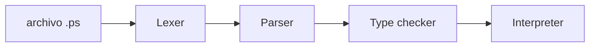

<h1 align="center">PrintScript G16</h1>

<p align="center">
  Un intérprete de <strong>PrintScript</strong> construido como un pipeline de análisis:<br>
  del archivo <code>.ps</code> al árbol de sintaxis, y de ahí hacia adelante.
</p>

<p align="center">
  <a href="https://github.com/G16IS/print-script/actions/workflows/ci.yml">
    
      
  </a>
</p>

<p align="center">
  
  
  
</p>

---

## Qué es esto

PrintScript es el lenguaje de script de la materia. Este repo es el compilador/intérprete del **grupo 16**: leés un programa, lo desarmás en piezas, armás el árbol y (más adelante) lo validás y lo ejecutás.

Hoy `interpretCode` llega hasta el **type-checker**. La ejecución (`println`) vive en `ExecuteCode` y se dispara con el CLI `run`. El formatter está en `FormatCode` / `CheckFormat`. El linter está en `LintProgram`.

```printscript
let pepe: string = "Hello, World!";
let pepa: number = 42;

println(pepe);
println(1 + 2 * 3);
```

Un programa típico declara variables con tipo, imprime, y combina números (o strings) con la aritmética de siempre.

---

## Cómo funciona

El diseño no es un monolito que “entiende PrintScript”. Es un **pipeline**: cada etapa hace una sola cosa y le pasa el resultado a la siguiente.



| Etapa | Qué hace | Estado |
|---|---|---|
| **Lexer** | Lee el archivo carácter a carácter y lo corta en tokens (`let`, un identificador, un `42`, un `+`…) | Listo |
| **Parser** | Arma el árbol de sintaxis statement por statement, respetando precedencia (`*` / `/` ganan a `+` / `-`) | Listo |
| **Type checker** | Chequea tipos, redeclaraciones y variables que no existen | Listo |
| **Interpreter** | Ejecuta el programa (`println`, expresiones) | Cableado en `ExecuteCode` (CLI `run`) |
| **Formatter** | Pretty-print / check de whitespace sobre el árbol | Cableado en `FormatCode` / `CheckFormat` |
| **Linter** | Estilo / análisis estático | Cableado en `LintProgram` |

Dos ideas que recorren todo el proyecto:

1. **Streaming.** Ni el lexer ni el parser se comen el archivo de una. Van leyendo de a poco: caracteres → tokens on demand → un statement por llamada.
2. **El lenguaje no está hardcodeado.** Qué es un token y qué es una producción válida vive en JSON. El Kotlin es el motor; PrintScript es la config.

```
language.config.json        →  cómo se reconocen las palabras del lenguaje
grammar.config.json         →  cómo se combinan esas palabras en un programa
type-system.config.json     →  tipos, operaciones y nodos a chequear
```

Agregar un keyword o una forma de statement, en el caso feliz, es editar esos archivos — no reescribir el parser.

---

## El lenguaje, hoy

PrintScript **v1**, el que describe la config actual:

| Se puede | Todavía no |
|---|---|
| `let nombre: string \| number = …;` | `if`, llaves, bloques |
| `println(expresión);` | Varios argumentos en `println` |
| Literales, identificadores, `+ - * /` y paréntesis | Asignaciones sueltas (`x = 1;`) |
| `*` y `/` con más precedencia que `+` y `-` | |
| `+` entre strings = concatenación *(a nivel semántico)* | |

El parser ya sabe evaluar repeticiones (`repeat`), pensado para cuando lleguen los bloques. La gramática v1 todavía no los usa.

---

## Anatomía del repo

Monorepo Gradle. Cada carpeta es una pieza con un rol chico:

```
.ps  →  infrastructure  →  lexer  →  parser  →  type-checker  →  application
              ↑                 ↑         ↑            ↑
           configs JSON      common (contratos compartidos)
```

- **`common`** — el vocabulario: tokens, gramática, árbol, type-system, posiciones. Nadie habla con nadie sin pasar por acá.
- **`infrastructure`** — lee los JSON y el archivo fuente. Es la única pieza que sabe de disco y de serialización.
- **`lexer` / `parser` / `type-checker`** — motores genéricos. No conocen `let` ni `println` a palo; conocen reglas y kinds de la config.
- **`application`** — arma el pipeline. `interpretCode` lexea, parsea y type-chequea; `ExecuteCode` además interpreta.
- **`cli`** — Clikt: `run` / `lint` / `check` / `format` / `typecheck`.
- **`build-logic`** — calidad del *código Kotlin* (ktlint + detekt). No es el linter de PrintScript.

El detalle de cada módulo, invariantes y recetas de extensión está en [`docs/CONTEXT.md`](docs/CONTEXT.md).

---

## Correrlo

Hace falta **JDK 21**.

```bash
./gradlew test          # todos los módulos
./gradlew ktlintCheck   # estilo (lo mismo que el badge Format)
./gradlew detekt        # análisis estático (lo mismo que el badge Lint)

./gradlew ps-run examples/hello.ps
./gradlew ps-lint examples/hello.ps
./gradlew ps-check examples/hello.ps
./gradlew ps-format examples/hello.ps
./gradlew ps-typecheck examples/hello.ps
```

CI ([`ci.yml`](.github/workflows/ci.yml)) en cada push / PR, en paralelo: wrapper, `ktlintCheck`, `detekt`, y un job `assemble` + `test` (mismo runner, un compilado).

---

## Docs

| Para… | Empezá por |
|---|---|
| Entender el proyecto entero | [`docs/CONTEXT.md`](docs/CONTEXT.md) |
| Cambiar tokens / keywords | [`docs/configs/LANGUAGE_CONFIG.md`](docs/configs/LANGUAGE_CONFIG.md) |
| Cambiar la sintaxis | [`docs/configs/GRAMMAR_CONFIG.md`](docs/configs/GRAMMAR_CONFIG.md) |
| Cambiar tipos / operadores | [`docs/configs/TYPE_SYSTEM_CONFIG.md`](docs/configs/TYPE_SYSTEM_CONFIG.md) |
| Un módulo en particular | [`docs/modules/`](docs/modules/) |

---

<p align="center">
  <sub>Grupo 16 · Ingeniería de Sistemas · Universidad Austral</sub>
</p>
